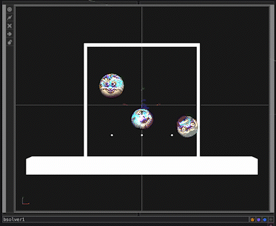

A standout feature in TouchDesigner is its capability to function as a VST host, opening up a world of creative possibilities for integrating audio into your projects. VST, short for Virtual Studio Technology, empowers you to seamlessly incorporate synthesizers and effects processors, treating them as you would any other node in your project.

I used the VST capabilities in an installation I created for an interactive art exhibition my friends and I curated last autumn. The concept revolved around a communication conduit designed to engage with entities dubbed FRENS (Frequency Resonators Emitting Noteworthy Sounds). Through projection mapping, visitors wielded a MIDI controller to interact with the FRENS, dynamically altering their visual attributes and the sounds they produced.

> **Want to **[**download the project files**](https://dimin-backup.s3.us-west-2.amazonaws.com/di/frens-tutorial.zip)** and try it out? Sure ya do.**

I haven’t seen many examples of other people using VSTs in TouchDesigner, so I thought it would be a great subject for a tutorial. Before we get started, let’s have a look at what we’re making.

<div class="video-embed"><iframe src="https://player.vimeo.com/video/929117372?app_id=122963" title="Embedded video" loading="lazy" allow="accelerometer; autoplay; clipboard-write; encrypted-media; gyroscope; picture-in-picture; web-share" allowfullscreen></iframe></div>

I’ve created a simplified version of my installation for this walk-through. The project is based around a simple physics simulation. I’m dropping spheres in the scene and when those spheres hit the bottom, they trigger a note and an animation. I generated several FRENS textures using Adobe Firefly and used those images to texture the spheres in the scene. Seems easy, right? It is! Let’s break down this project, starting with the physics.



This GIF shows you what’s happening behind the scenes of the Bullet Solver physics simulation. Spheres are spawned at three points above the rendered view. They then fall, eventually colliding with three small “bumpers” that align with the bottom of the rendered view. Eventually the FRENS find their way past these bumpers to the “floor” cube at the bottom of the scene. When they collide with this box, they are re-spawned at the top with a new texture image. I added walls and ceiling boxes to the simulation so that they don’t go flying off into space. Since we don’t need any Z motion in this case, it’s being computed as a 2D simulation.

One of the best things about the Bullet Solver comp is that you can use the callbacks to define what happens when objects collide. That’s where most of the magic is happening in this simulation. Let’s have a look at our `onCollision` callback.

```python
def onCollision(solverComp, collisions):

 for collision in collisions:
  # Let's store some cumbersome expressions in nice short variables
  b1 = collision.bodyA
  b2 = collision.bodyB
  floor = op('bsolver1/floor')
  bumper = op('bsolver1/bumper1')

  # Test to see if the collision is a FREN hitting the floor
  if b1.owner != floor and b2.owner == floor:
   # Move it to its spawn point
   b1.translate = newPoint(solverComp, b1.index)
   # Set its velocity and rotation back to 0
   b1.linearVelocity = tdu.Vector(0, 0, 0)
   b1.angularVelocity = tdu.Vector(0, 0, 0)
   b1.rotate = tdu.Vector(0, 0, 0)
   # Choose a new texture for the newly-spawned FREN
   op('bsolver1/table1')[b1.index, 0] = random.randint(0, op('bsolver1/base1/folder1').numRows)

  # This is just a reversed version of the above
  # Is it repetetive? Is there a better way to do this? Yeah, probably. 
  # But whatever. We're having fun here.
  elif b2.owner != floor and b1.owner == floor:
   b2.translate = newPoint(solverComp, b2.index)
   b2.linearVelocity = tdu.Vector(0, 0, 0)
   b2.angularVelocity = tdu.Vector(0, 0, 0)
   b2.rotate = tdu.Vector(0, 0, 0)
   op('bsolver1/table1')[b2.index, 0] = random.randint(0, op('bsolver1/base1/folder1').numRows)

  # Check to see if a FREN hit a bumper
  elif b1.owner == bumper and collision.impact:
   # If the Y component of the FREN's velocity is greater than 1, 
   # play a note and trigger the pulse animation.
   # Why check the velocity? I don't want to trigger notes if the FREN 
   # somehow bounced back up towards the bumper.
   if b2.linearVelocity[1] > 0:
    playNote(b1.index)
    pulse(b1.index)
    
  # Yeah. Repetitve code again. Sue me.
  elif b2.owner == bumper and collision.impact:
   if b1.linearVelocity[1] > 0:
    playNote(b2.index)
    pulse(b2.index)
```

In this collision callback, we can now play a note when a FREN hits a bumper and spawn a new FREN when they hit the floor. Now comes the fun part. Playing notes! Let’s look at that `playNote` method.

```python
def playNote(index):
 chord = int(op('chord')[0].eval())
 chords = [
  [9, 1, 4],   # A Major
  [10, 2, 5],  # A# Major / Bb Major
  [11, 3, 6],  # B Major
  [0, 4, 7],   # C Major
  [1, 5, 8],   # C# Major / Db Major
  [2, 6, 9],   # D Major
  [3, 7, 10],  # D# Major / Eb Major
  [4, 8, 11],  # E Major
  [5, 9, 0],   # F Major
  [6, 10, 1],  # F# Major / Gb Major
  [7, 11, 2],  # G Major
  [8, 0, 3],   # G# Major / Ab Major
  
  [9, 0, 4],    # A Minor
  [10, 1, 5],   # A# Minor / Bb Minor
  [11, 2, 6],   # B Minor
  [0, 3, 7],    # C Minor
  [1, 4, 8],    # C# Minor / Db Minor
  [2, 5, 9],    # D Minor
  [3, 6, 10],   # D# Minor / Eb Minor
  [4, 7, 11],   # E Minor
  [5, 8, 0],    # F Minor
  [6, 9, 1],    # F# Minor / Gb Minor
  [7, 10, 2],   # G Minor
  [8, 11, 3],   # G# Minor / Ab Minor
 ]

 octaves = [12 * 3, 12 * 4, 12 * 5]
 channel = 1
 note = chords[chord][index] + random.choice(octaves)
 velocity = 127

 op('audiovst1').sendNoteOn(channel, note, velocity, noteOffDelay=250)
```

There’s a lot going on here, so let’s break it down. It would be really easy to just play a random note when a FREN hits a bumper, but that would sound like a cat running across a piano. For this to make musical sense, I decided to lock the FRENS into playing a single chord at a time. To do this, we need to understand a little about MIDI and music theory.

Let’s start with the music theory. In their simplest form, musical chords are made up of three notes, or a “triad”. The three notes in a triad are:

1. **Root Note**: This is the primary note of the chord and serves as its foundation. It determines the name and overall quality of the chord. For example, in a C major chord, the root note is C.
2. **Third**: The second note in a chord is the third. It’s called the third because it’s usually the third note in the scale when counting from the root note. The distance between the root note and the third determines the quality of the chord (major or minor).
3. **Fifth**: The third note in a chord is the fifth. Like the third, it’s named based on its position in the scale relative to the root note. The fifth helps to define the stability and overall sound of the chord.

MIDI (Musical Instrument Digital Interface) notes are represented by numbers ranging from 0 to 127, where each number corresponds to a specific note. So, the MIDI note numbers for a C major chord (C-E-G) would be 60 (C4), 64 (E4), and 67 (G4), respectively.

That’s what the chords array in the previous code block is all about. I’m defining the MIDI notes for each triad. I’m then using a Radio Button Widget to make that chord selection.


So what’s happening on that “octaves” line? In music, there isn’t just a single C, there are low C’s and high C’s and some in-between C’s. Since we know there are 12 notes in an octave, we know that all those C’s will be exactly 12 notes apart.

That means that if Middle C is 60, the next higher C will be 72. The C below middle C is 48. So in my chords array, I’m defining the lowest possible triad and then with the octaves array, I’m creating a list of three multiples of 12 which I can then add to those triads to get the same chord in three different octaves.

Now that our brains are full of music theory, let’s just play some friggin’ music, shall we? Here is the last line of that last code block.

```python
op('audiovst1').sendNoteOn(channel, note, velocity, noteOffDelay=250)
```

Here we are using the built-in `sendNoteOn` method of the AudioVST CHOP to tell it to play a note. We need to send it a few parameters so it knows what to play.

`channel` is the MIDI event channel to send the note on. Since we’re only working with a single channel of MIDI, that can be 1.

`note` is the value of the note to play, which we figured out above.

`velocity` can be thought of as how “hard” to play the note. When you strike a key on a piano keyboard with a lot of force, it’s louder than when you just barely touch it. We’re going to send the max value of 127.

`noteOffDelay` is an optional parameter that will send a “note off” message after a certain time. Since we don’t want these notes to ring out forever, we’ll stop them after 250 milliseconds.

We’re dangerously close to having a completed project here. All we need now is a virtual instrument that will play the notes we’re asking it to.

It’s important to keep in mind that the [Audio VST CHOP](https://docs.derivative.ca/VST) won’t do much by itself, you’ll need to find some VST plugins. Luckily, there are SO MANY options out here. For this project, I’m using the fantastic [Surge XT](https://surge-synthesizer.github.io/) synthesizer. If you’d like to try out this project, simply download and install the right Surge XT version for your platform. Then point the Audio VST CHOP’s “File” parameter to the installation location for your VST.

When you click the “Display Plugin GUI” button in the Audio VST CHOP, it opens a window that looks a little something like this.


Look at all the knobs and sliders! Each VST has its own UI based on what features and functions it has. One powerful feature of the Audio VST CHOP is that all those knobs and sliders are dynamically controllable by your TouchDesigner project. We’re not doing any of that in this project, we are simply finding a synth patch we like the sound of and then using the Python above to tell this VST to play notes. But the possibilities for dynamically controlling audio are wide open!

Adding dynamic and interactive audio to your TouchDesigner projects can greatly amplify the immersive qualities of your work. The more senses you can engage, the richer the experience is for the people experiencing your work. I hope this post helps you have fun adding VSTs to your projects!
