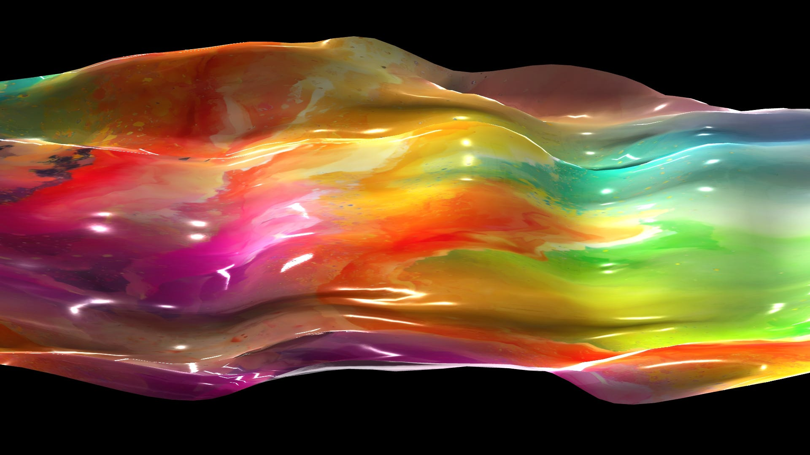

_Ooo yeah. That’s gooey._

I love being able to make an image that you can feel. Just imagine running your fingers over this thing. You can almost feel it, right? It’s like a slightly rough plastic with layers of old paint that feel like rough spots on the surface.

> Are you one of those people who just want a link to the source files?  
>  [**Well here ya go**](https://dimin-backup.s3.us-west-2.amazonaws.com/di/gooey-tutorial.zip)**, you greedy so-and-so.**

If you want to create textures that make materials mimic real-world surfaces, then you need to make friends with the [PBR Mat](https://docs.derivative.ca/PBR_MAT). Physically Based Rendering (PBR) achieves realistic rendering by simulating the physical behavior of light interacting with surfaces and materials. It involves accurately modeling how light bounces off surfaces, taking into account things like reflectivity and roughness. And that’s where my knowledge ends. Shader programming is a dark art practiced by people much smarter than me.

But like with many things, TouchDesigner makes working with PBR extremely easy. Before we get started, let’s have a look at what we’re making.

<iframe src="https://player.vimeo.com/video/927790169?app_id=122963" title="Embedded video" loading="lazy" allow="accelerometer; autoplay; clipboard-write; encrypted-media; gyroscope; picture-in-picture; web-share" allowfullscreen></iframe>

_Ooo yeah. Goo being live-rendered at 60fps!_

We’re only doing two things in this sketch. 1) Making a wobbly shape and 2) applying a texture to it. So let’s start with our wobbly shape. There are a billion ways to make wobbly geometry in TD, but this is one of my favorites.

The idea for making this shape comes from what’s happening in this image.

_You ever play with a parachute in school? Was it just me?_

Imagine the parachute is our shape. Since we want that shape to wobble, we ask some kids to hold the edges of the shape and move their arms up and down randomly. This is barely even an analogy because that’s almost exactly what we’re going to do in Touch Designer.

“But Chris,” you might be thinking, “why don’t you just drop a Noise SOP after the grid, you handsome man.” First off, thank you. Second, I’ve done that. A lot. Honestly, too much. No hate for the noise-distorted grid, but a man does not live by bread alone. Gotta branch out.

Like with many great sketches, this one begins with a grid.

For this to render properly, we need a to change the primitive type to Polygon. I wish I could tell you why Mesh won’t work here, but I honestly have no idea. I would love if someone with the answer would comment. We also want a higher resolution grid, so I cranked those sliders up to 50 here.

Next, we need to select which points in this grid will represent our kids on the edges of the parachute.

To do this, we’re going to use the Group SOP to make a named group of the points that will be our parachute kids. To do this, I’m using the Bounds method and saying “give me every point that’s inside 0.99 from the origin.”

You might be wondering why I’m selecting the INSIDE points. Aren’t our parachute kids on the OUTSIDE? Yeah, hold on. We’re getting to that.

I just want to invert my selection, so I’m adding another Group SOP and using the Not option. I’m essentially saying, “Remember that group I made in the last node? Yeah, give me all the points NOT in that group.” So now we have all our parachute kids, represented here by some yellow dots surrounding a bunch of blue dots.

Now we need to ask them to move their hands up and down randomly.

Yeah! Here comes the noise. I’m using a period of 0.5 and I like to turn the roughness all the way down. Now we have all our parachute kids moving their hands up and down. We’re almost there, but we need to add the secret sauce.

The secret sauce in this sketch is the Spring SOP. This SOP is so fun. All you have to do is provide this node with some geometry and it will put springs between all its points. Importantly, we’re telling this node to use the group we just made as the static points. All other points will be free to flow around based on the motion of their neighbors. This creates all these wonderful ripples and waves that seem to flow inward from the edges. It creates fun interactions between the ripples that give it a great natural feel. Just like our parachute!

Now we want to compute both normals and tangents using an Attribute Create SOP. This adds in the information necessary for our shader to get all the lights and shadows right.

The PBR material model is designed to mimic real-world behavior, including how light reflects and refracts off surfaces. In reality, objects don’t just receive direct light from a single source; they also interact with the light from their surroundings, including reflections and ambient illumination.

The environment light in TouchDesigner provides this ambient lighting info. It helps to simulate the indirect lighting in the scene, such as light bouncing off nearby surfaces and contributing to the overall illumination of things.

I’m adding an Environment Light and a regular Light to this scene. A very important part of an Environment Light is the Environment Map. This is an image that represents the environment your geometry will be living in. This can be any image, but you really want to use an HDRI image. HDRI stands for High Dynamic Range Imaging. It’s a technique used to capture and represent a wide range of luminance values in an image. If you’re looking for some, why not check out [Poly Haven](https://polyhaven.com/hdris/outdoor)? Try several. It’s wild how much influence these have over the render, they can completely change the feel of a scene.

Next up are our new friend the PBR Mat and it’s best bud, the Substance TOP. Substance materials are procedural textures generated using the Substance Designer software. These materials give us a high level of flexibility and realism, allowing for the creation of a wide range of textures like wood, metal, fabric, and in our case, gooey plastic.

Substance TOPs aren’t absolutely necessary for the PBR Mat to work. You can source your own materials which often come with several texture map files. (Roughness, Normal, Metallic, etc) Simply drop those textures into your file and assign them to the appropriate Maps spots on the PBR Mat node. You can think of a Substance TOP as a shortcut for this. It has all those textures built in to a single file. Looking for Substance files? Try [Adobe Community Assets](https://substance3d.adobe.com/community-assets).

I’m using a plastic texture that I really like. Substance files are created with controllable parameters that are exposed on the Input Values page of the component. You can spend so much time tweaking these values to get different looks. So satisfying.

By default, this gives me a blue plastic color. That’s great and all, but I really want to make it more interesting than a single color. So I’m going to override the base color attribute coming from the Substance TOP by choosing an image and assigning it to the Base Color map on the PBR Mat. I’m also running this same image into a Normal TOP to generate a custom normal map. This overrides the normals defined in the Substance TOP. Since our new normal is based on the base color image, the natural edges that appear in our texture will produce really nice edges and bumps where you would naturally expect them to occur.

I created a texture for this in [Adobe Firefly](https://firefly.adobe.com/). That’s how I can claim that this artwork is “partially AI generated” and get an SEO boost for this blog post. AI, man… so hot right now. But I really have enjoyed having text-to-image tools to generate assets for my sketches.

That’s it! That’s the whole sketch, tutorial over! Yes, I skipped over details like the render and camera nodes and what that Point SOP is doing in there. (The Point SOP is removing the normals from the grid so the Spring SOP doesn’t use them as a initial velocities) But that’s it! That’s all you get!

But sincerely, I hope you learned something fun and/or useful. Have fun making all kinds of realistic textures in TouchDesigner!
