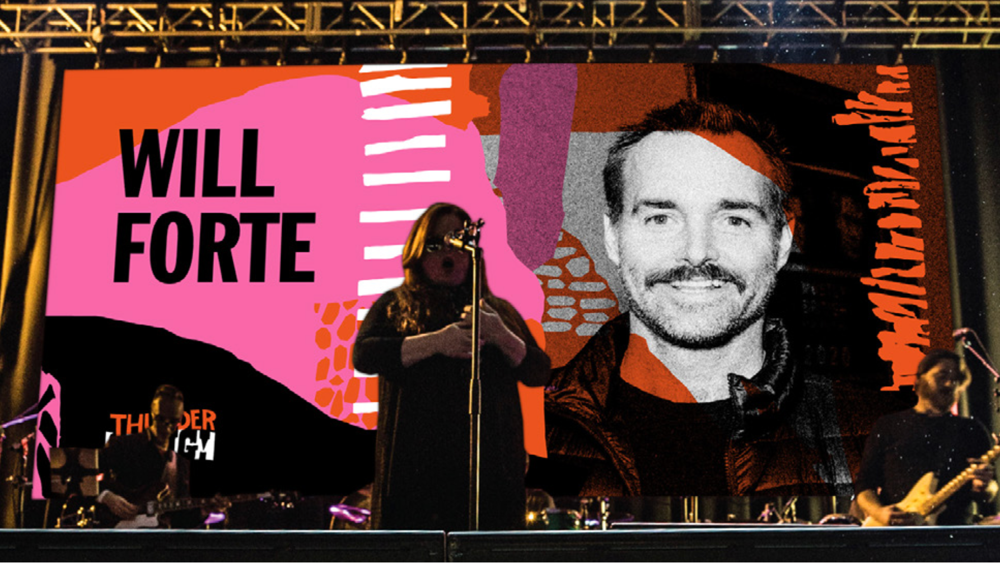

For the last three years, I’ve had the opportunity to contribute some fun interactive visual work to [Thundergong](https://thundergong.org), an annual benefit concert presented by the [Steps of Faith Foundation](https://www.stepsoffaithfoundation.org/) and hosted by Jason Sudeikis. I’ve gotta say, I think this year’s show might have been the best one yet. But don’t take it from me, just check out this video of Weird Al Yankovic and Will Forte covering Chappell Roan’s HOT TO GO.

<iframe src="https://www.youtube.com/embed/KaiyQ7jJMaI?feature=oembed" title="Embedded video" loading="lazy" allow="accelerometer; autoplay; clipboard-write; encrypted-media; gyroscope; picture-in-picture; web-share" allowfullscreen></iframe>

We focused this year on developing live interactive visuals for the LED walls on stage. Our look this year (developed by [Micah Smith](https://www.amicahsmith.com/)) was inspired by [Sister Corita Kent’s](https://www.corita.org/) vibrant art. Think bold, energetic colors that overlap and blend in this beautifully imperfect way. We were playing with layered paper cutouts and letting colors mix freely to create a sense of movement.

Our friends at [Loud Productions](https://www.loudproductiongroup.com/) provided us with some amazing LED walls, two at stage right and left, as well as two panels that flank the central 16:9 display. All in all, we had 18 square meters of LED wall to play with.

<iframe src="https://www.youtube.com/embed/q7HDa3aDmgI?feature=oembed" title="Embedded video" loading="lazy" allow="accelerometer; autoplay; clipboard-write; encrypted-media; gyroscope; picture-in-picture; web-share" allowfullscreen></iframe>

*I am not a professional drummer.*

We wanted to try some new things this year. First off, we wanted to give Billy, the drummer and co-host of the show, direct control over the effects happening on the video walls. To do this, we started with rolling our own drum-hit-sensing solution. We cobbled together a system using [Phidgets](https://phidgets.com/) accelerometers. While this solution was workable, we opted for an off-the-shelf MIDI drum trigger. These fun little devices clamp to the drum heads and send MIDI notes when the drums are hit.

Using that device, we could then use MIDI information to drive visuals on the LED walls, as well as send DMX control messages to the lighting team’s equipment. In the video above, I have a simple TouchDesigner app translating the MIDI drum trigger notes into DMX control messages that flash the lights.

*See that small red box in the lower left? That’s our MIDI trigger device.*

In addition to the drum-triggered effects, we used a MIDI control surface to orchestrate all the other visual effects. This allowed us to preform our part of the show live with the band. Here’s a video that breaks down how that worked during the show.

<iframe src="https://www.youtube.com/embed/-q-r05jQ-NI?feature=oembed" title="Embedded video" loading="lazy" allow="accelerometer; autoplay; clipboard-write; encrypted-media; gyroscope; picture-in-picture; web-share" allowfullscreen></iframe>

*Our stage-right workstation just before showtime.*

And as in past years, we also had a touch screen interface for all the other video wall controls: Switching between songs, triggering messages and live previz of the video walls as well as a preview of the roaming camera feed used in the composition.

<iframe src="https://www.youtube.com/embed/XMUx34AsYlM?feature=oembed" title="Embedded video" loading="lazy" allow="accelerometer; autoplay; clipboard-write; encrypted-media; gyroscope; picture-in-picture; web-share" allowfullscreen></iframe>

Everything came together so well this year, I really love collaborating with the team that puts this show together. I’m so grateful for the opportunity to make really cool stuff with talented friends for such a worthy cause.

I’ll leave you with another video from the show. Flavor Flav and Jason doing the Public Enemy and Anthrax classic Bring the Noise.

<iframe src="https://www.youtube.com/embed/w3sLErdKseI?feature=oembed" title="Embedded video" loading="lazy" allow="accelerometer; autoplay; clipboard-write; encrypted-media; gyroscope; picture-in-picture; web-share" allowfullscreen></iframe>

